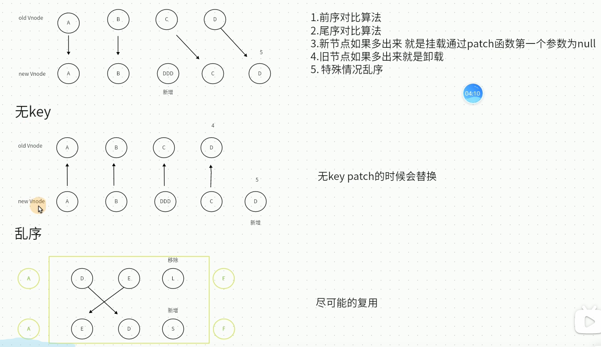
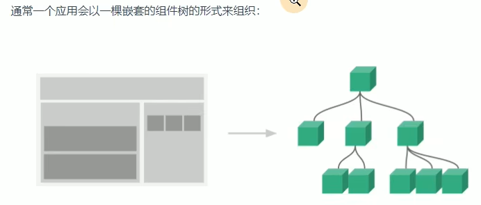

# vue3 + vite +ts +pinia 学习


#### 前端相关

- `vue3 setup` 语法糖
- `vite`
- `typescript`
- `pinia`


> vue 使用MVVM模式

`view` 视图层

`viewModel` 业务逻辑层

`model` 数据层


> vue3新特性

重写双向数据绑定

​	基于`Proxy`代理监听实现数据双向绑定

VDOM性能瓶颈

​	增加`patch flag` 静态标记优化静态树，如

```
TEXT = 1 // 动态文本节点
CLASS = 1 << 1 // 2 动态class
STYLE = 1 << 2 // 4 动态style
PROPS = 1 << 3 // 8 动态属性
FULLPROPS = 1 << 4 // 16 具有key属性，key改变时需进行完整的diff比较
HYDRATE_EVENT = 1 << 5 // 32 带有监听事件的节点
STABLE FRAGMENT = 1 << 6 // 64 一个不会改变子节点顺序的fragment
KEYED_FRAGMENT = 1 << 7 // 128 带有key属性的fragment，或部分子节点有key
UNKEYED FRAGMENT = 1 << 8 // 256 子节点没有key的fragment
NEED PATCH = 1 << 9 // 512 一个节点只进行非props比较
DYNAMIC_SLOTS = 1 << 10 // 1024 动态slot
HOISTED = -1 // 静态节点
BALL = -2 // 
```

​	例如，可以在线查看vue3节点转换规则，[vue3 template 节点转换](https://vue-next-template-explorer.netlify.app/)

`fragments`

​	允许多个根节点，同时支持`render JSX`写法

​	新增`Suspense`和多v-model用法

`tree-shaking` 的支持

​	将全局API进行分块，即不使用某些功能则不会打包多余的代码

​	如使用`import {watch} from 'vue'`，则其他如`computed`等没用到的API则不会打包以减少体积

`composition API`

​	`setup`函数编程也可叫`vue hook`，例如`ref reactive watch`等


> vue3构建项目

使用`vite`构建，基于`vite`打包 

​	`npm init vite@latest`，然后根据需要选择即可

​	`vite`优势：冷服务-使用原生`ESM`动态导入；`HMR`-模块热更新；`rollup`打包

使用`@vue/cli`构建，基于`webpack`打包

​	`npm i -g @vue/cli` // 4版本以上

​	`vue create xx`


> `nvm` `nrm` 简单介绍

​	`nvm` 管理多个`node`版本

​	`nrm` 管理源管理器


> vue文件结构

```
// 模板
<template></template>

// 可以写多个，但有setup标签只能写一个
<script setup lang="ts"></script>

// 样式，可以写多个
<style></style>
```


> vue3的vscode插件

​	`volar`，与`vetur`相同但功能更强大，需要将`vetur`禁用，安装`Vue Language Feature(Volar)` `TypeScript Vue Plugin(Volar)`


> vue3 基础语法/指令

```
<template>
	<!-- 模板语法 ->
	<div>{{ msg }}</div>
	<!-- 文本 ->
	<div v-text="msg"></div>
	<!-- 富文本 ->
	<div v-html="msg"></div>
	<!-- 条件语句，控制隐藏 ->
	<div v-show="msg">{{ msg }}</div>
	<!-- 条件语句，控制隐藏，会销毁 ->
	<div v-if="msg === '1'">1</div>
	<div v-else-if="msg === '2'">2</div>
	<div v-else>{{ msg }}</div>
	<!-- v-bind/: 动态绑定属性 ->
	<div :data="msg">{{ msg }}</div>
	<!-- 双向数据绑定 ->
	<input v-model="msg" />
	<!-- 遍历 ->
	<div v-for="val in 10">{{ val }}</div>
	<!-- 
		v-on/@ 添加事件 
		.stop // 阻止冒泡修饰符
		.prevent // 阻止捕获
		.capture // 使用捕获
		.self // 点击本身
		.once // 点击一次有效
		.passive // 允许默认行为
		[addEventListener 方法说明](https://developer.mozilla.org/en-US/docs/Web/API/EventTarget/addEventListener#parameters)
	->
	<div @click.stop="msg">{{ msg }}</div>
</template>

<script setup lang="ts">
	import { ref } from 'vue'
	const msg = ref<string>('1')
	const handleClick = () => {
     	console.log(msg.value)
	}
</script>
```


> vue3 虚拟DOM和diff算法




> ref 全家桶

```
<template>
  <button @click="handleClick">按钮</button>
  <p>{{ msg }}</p>
  <p>{{ sMsg }}</p>
</template>

<script setup lang="ts">
	import {ref, Ref, isRef, shallowRef, triggerRef, customRef} from 'vue'
	const msg = ref<string>('a')
	// 或使用Ref定义类型
	// const msg: Ref<string> = ref('a')
	// 定义浅响应式ref对象
	const sMsg = shallowRef({
      name: '1'
	})
	const handleClick = () => {
      msg.value = 'b'
      // 判断是否为ref对象
      console.log(isRef(msg))
      sMsg.value.name = '2'
      // 强制在页面刷新
      triggerRef(sMsg)
	}
	
	// 自定义ref
	function MyRef<T>(value: T) {
      return customRef((trank, trigger) => {
        return {
          get() {
          	// 收集依赖
            trank()
            return value
          },
          set(newValue) {
          	console.log('set')
          	value = newValue
          	// 触发更新
            trigger()
          }
        }
      })
	}
	const myMsg = MyRef<string>('哈哈')
	
</script>
```

`ref` 设置为响应式数据

​	原理：`createRef`方法本质上也是利用`reactive`进行代理的。建议基本类型使用`ref`，引用类型使用`reactive`

`isRef` 判断是否为`ref`对象

`shallowRef` 设置跟踪自身`.value`变化的`ref`，即浅响应式

​	注意：如果在同一方法中修改了`ref`定义的值和`shallowRef`定义的值，会一并将新修改的`shallowRef`的值一并更新。原因是`ref`的值修改会调用`triggerRefValue`方法触发视图更新，而`triggerRef`方法本质上也是调用了`triggerRefValue`方法进行视图更新的

`triggerRef` 对浅响应式`shallowRef`强制刷新页面，一般配合`shallowRef`使用

`customRef` 自定义`ref`，返回一个工厂函数自定义`ref`


> reactive 全家桶

```
<template>
  <button @click="handleClick">按钮</button>
  <div>{{state.name}}</div>
</template>

<script setup lang="ts">
	import {reactive, readonly, shallowReactive} from 'vue'
	
	interface Info {
      name: string,
      age?: number
	}
	const state = reactive<Info>({
      name: '小明'
	})
	const handleClick = () => {
      state.name = '小红'
	}
	
	// readonly 拷贝只读
	const c = readonly(state)
	
	const s = shallowReactive({
      name: '小花',
      fav: {
        name: '游泳'
      }
	})
	
</script>
```

`reactive` 设置响应式数据，代理引用类型

​	注意：直接结构会变成普通对象/普通类型，可通过`toRef`或`toRefs`结构

`readonly` 拷贝一份`proxy`对象并设置为只读

`shallowReactive` 设置浅响应式，只代理第一层

​	注意：`shallowReactive` 代理的值在`onMounted`前被修改，会影响到视图

`shallowReadonly` 只拷贝一份浅`proxy`代理对象并设置为只读

`isProxy` 检查对象是否由`reactive`或`readonly`创建的proxy

`isReactive` 检查对象是否由`reactive` 创建的响应式代理

`isReadonly`检查对象是否由`readonly` 创建的响应式代理


> to系列全家桶

```
<template>
  <button @click="handleClick">按钮</button>
  <!-- 点击不会改变，因为obj不是响应式代理 ->
  <div>{{ obj.foo }}</div>
  <!-- 点击会改变 ->
  <div>{{ state }}</div>  
  <div>{{ name }}</div>
  <!-- 点击会改变 ->
  <div>{{ age }}</div>

</template>

<script setup lang="ts">
	import {toRef, reactive, toRefs, toRaw} from 'vue'
	const obj = {
      foo: 1,
      bar: 2
	}
	const state = toRef(obj, 'foo')
	const handleClick = () => {
      state.value++
      age.value = 19
	}
	
	const state = reactive({
      name: '小明',
      age: 18
	})
	const {name, age} = toRefs(state)
	// 将reactive对象转换成普通对象
	const r = toRaw(state)
	
</script>
```

`toRef` 将对象某个属性转成`proxy`代理。会改变原始对象，因此如果原始对象是响应式代理，`toRef` 代理的值改变，页面引用了原始对象对应的属性也会在视图上更新

`toRefs` 将响应式对象转成普通对象，其中每个属性指向原始对象属性的`ref`，即将多个属性转换成`ref`代理

`toRaw` 将响应式对象转换成普通对象


> computed 计算属性

```
<template>
  <div>{{ cName }}</div>
</template>

<script setup lang="ts">
  import {ref, computed} from 'vue'
  const name = ref('小红')
  const cName = computed(() => {
    return name.value + '：'
  })
  // 用法2
  const cc = computed({
    get() {
      return name.value + "："
    },
    set() {
      name.value + '：'
    }
  })
</script>
```


> watch 侦听器

```
<script setup lang="ts">
  import {ref, watch} from 'vue'
  const msg = ref<string>('')
  // 用法1 推荐
  watch(() => msg, (newVal, oldVal) => {
    console.log(newVal)
  }, {
    immediate: true
  })
  // 用法2
  watch(msg, (newVal, oldVal) => {
    console.log(newVal)
  })
  // 监听多个
  const msg2 = ref<string>('')
  watch([msg, msg1], (newVal, oldVal) => {
    // newVal 为对应数量的数组
  })
</script>
```


> watchEffect 高级侦听器

```
<script setup lang="ts">
  import {ref, watchEffect} from 'vue'
  const msg1 = ref<string>('')
  const msg2 = ref<string>('')
  const stop = watchEffect((onInvalidate) => {
    console.log(msg1.value)    
    console.log(msg2.value)
    onInvalidate(() => {
      // 先执行这个回调再执行里面代码块
    })
  })
  // 停止监听
  stop()
  
  /** 
    watchEffect 说明
    function watchEffect(
      effect: (onInvalidate: InvalidateCbRegistrator) => void,
      options?: WatchEffectOptions
    ): StopHandle

    interface WatchEffectOptions {
      // pre 组件更新前执行 post 组件更新后执行 sync 强制效果始终同步触发
      flush?: 'pre' | 'post' | 'sync' // 默认：'pre'
      // 开发环境调试所用，将在响应式 property 或 ref 作为依赖项被追踪时被调用
      onTrack?: (event: DebuggerEvent) => void
      // 开发环境调试所用，将在依赖项变更导致副作用被触发时被调用
      onTrigger?: (event: DebuggerEvent) => void
    }
  */
</script>
```


> 组件与生命周期



```
<template>
  <HelloWorld />
</template>

<script setup lang="ts">
  import HelloWorld from './HelloWorld.vue'
  import {
    onBeforeMount,
    onMounted,
    onBeforeUpdate,
    onUpdated,
    onBeforeUnmount,
    onUnmounted
  } from "vue"
  onBeforeMount(() => {
    // 渲染前
  })
  onMounted(() => {
    // 渲染后
  })
  onBeforeUpdate(() => {
    // 更新前
  })
  onUpdated(() => {
    // 更新后
  })
  onBeforeUnmount(() => {
    // 销毁前
  })
  onUnmounted(() => {
    // 销毁完成
  })
</script>
```


> 父子组件传值

```
<!-- 父组件 ->
<template>
  <div></div>
  <Child ref="child" title="啦啦啦" :list="[1, 2, 3]" @change="handleChange" />
</template>

<script setup lang="ts">
  import {ref} from "vue"
  const handleChange = (params) => {
    console.log(params)
  }
  const child = ref(null)
</script>

<!-- 子组件 child ->
<script setup lang="ts">
  import {ref} from "vue"
  type Props = {
    title: string,
    list: number[],
    bool?: boolean
  }
  //接收父组件传过来的值
  defineProps<Props>()
  // 定义默认值
  withDefault(defineProps<Props>(), {
    title: '默认值',
    list: () => [1, 2]
  })
  // 给父组件派发事件
  const emit = defineEmits(['change'])
  const handleClick = () => {
    emit('change', '1')
  }
  // 子组件暴露数据或方法给父组件
  const count = ref(0)
  defineExpose({
    count
  })
</script>

```

`defineProps` 子组件接口父组件传过来的值，`defineProps` 无须引入可直接使用

`withDefault` 定义传参默认值，`withDefault` 无须引入可直接使用

`defineEmits` 子组件给父组件派发事件（即子给父传值），`defineEmits` 无须引入可直接使用

`defineExpose` 子组件暴露数据或方法给父组件，没有暴露的在父组件中是不能获取到的，`defineExpose` 无须引入可直接使用


> 组件类型

全局组件，即通过`app.component`全局注册的组件，可在页面中直接使用

```
import Card from './Card/index.vue'
app.component('Card', Card)
```

局部组件，即通过`import`引入的组件

递归组件，即根据条件自己调用自己的组件，一般用于无限级列表展示，如果有事件派发，则自身调用的组件也要相应派发出去

```
<template>
  <div v-for="item in list" :key="item.id">
    <span>{{ item.title }}</span>
    <template v-if="item.children && item.children.length">
      <Tree :list="item.children" />
    </template>
  </div>
</template>

<script setup lang="ts">
  type List = {
    id: string,
    title: string,
    children?: List[]
  }
  type Props = {
    list: List[]
  }
  defineProps<Props>()
</script>

<script lang="ts">
  export default {
    name: 'Tree'
  }
</script>
```

动态组件，即使用内置组件`component` ，注意：setup语法糖中`components` 只能接收组件的实例，不能使用字符串，因此，如果使用代理的变量指向组件，最好将其转成非代理模式（使用`markRaw` 或`toRaw`）

```
<template>
  <component :is="state.compName" />
</template>

<script setup lang="ts">
  import {reactive, markRaw} from 'vue'
  import A from './A.vue'
  const state = reactive({
    name: 'A组件',
    compName: markRaw(A)
  })
</script>
```

异步组件，即使用`defineAsyncComponent` 引入组件，同时需要用`Suspense` 包裹异步组件。当在`setup` 语法糖中使用了异步方法（在`setup`中可直接使用`await` ），需要使用异步组件使用方式

```
<!-- A组件 ->
<script setup lang="ts">
  // 使用异步方法
  const data = await getDataInfo()
</script>

<!-- 使用 ->
<template>
  <Suspense>
    <template #default>
      <A />
    </template>
    <!-- 异步组件渲染完成前显示的插槽，一般用来显示加载动画效果 ->
    <template #fallback>
      loading
    </template>
  </Suspense>
  <A></A>
</template>

<script setup lang="ts">
  import {defineAsyncComponent} from "vue"
  const A = defineAsyncComponent(() => import('./A.vue'))
</script>
```


> 插槽

匿名插槽，使用`v-slot` 或 `#default` 

```
<template>
  <slot></slot>
</template>

<!-- 使用 ->
<template>
  <template v-slot>内容</template>
</template>
```

具名插槽，使用`v-slot:name`或`#name` 

```
<template>
  <slot name="header"></slot>
</template>

<!-- 使用 ->
<template>
  <template v-slot:header>内容</template>
</template>
```

插槽作用域，即插槽传值

```
<template>
  <slot name="header" title="哈哈哈"></slot>
</template>

<!-- 使用 ->
<template>
  <template v-slot:header="{title}">内容</template>
</template>
```

动态插槽，即动态修改插槽名字即可

```
<!-- 使用 ->
<template>
  <template #[name]>内容</template>
</template>

<script setup lang="ts">
import {ref} from "vue"
const name = ref('default')
</script>
```


> teleport 传送门组件

`Teleport` 组件可将模板渲染至指定节点，不受父级`style` `v-show` 等属性影响，但`v-if` 会受影响，常用于弹框等场景使用

```
<template>
  <teleport to="body">
  
  </teleport>
</template>
```


> keep-alive 缓存组件

用于组件缓存，具体使用看官方文档，移动端常用于前进缓存后退刷新。需要注意的是，在`keep-alive` 包裹的组件，不管是用路由、动态组件还是`v-if` 控制的组件都会被缓存的


> transition 动画过渡组件

常用于动画过渡，具体使用看官方文档

常配合动画库使用，`animate.css` 动画库，`gsap` js动画库


> provide/inject 依赖注入

```
<!-- 根组件 ->
<script setup lang="ts">
  import {provide, reactive, readonlu} from "vue"
  const state = reactive({
    count: 1,
    info: {
      name: '小明'
    }
  })
  provide('count', readonly(state.count))
</script>

<!-- 子节点组件 ->
<script setup lang="ts">
  import {inject} from "vue"
  const count = inject('count', 0)
</script>
```

`provide` 根组件传值，参数1 自定义名称，参数2 值（建议为只读的响应式数据）

`inject` 子节点组件获取值，参数 1 根组件传递的名称 参数2 默认值（如果不传获取的数据为unknown类型），可选


> 兄弟组件传参

方式1 利用父组件（不建议）

方式2 利用`mitt` 插件（推荐）

```
<!-- 在全局挂载 main.tx 不推荐 ->
<script setup lang="ts">
  import {createApp} from 'vue'
  import App from './App.vue'
  import mitt from 'mitt'
  const app = createApp(App)
  const Mit = mitt()
  // 声明
  declare module 'vue' {
    export interface ComponentCustomProperties {
      $bus: typeof Mit
    }
  }
  app.config.globalProperties.$bus = Mit
</script>

<!-- 方式2 在单独js文件中设置导出一个实例使用 推荐 ->
```

方式3 使用 `vuex` 或 `pinia` （推荐）


> 使用tsx

首先安装 `npm i @vitejs/plugin-vue-jsx -D`

在`vite.config.ts` 中配置该插件

```
import {defineConfig} from 'vite'
import vue from '@vitejs/plugin-vue'
import vueJsx from '@vite/plugin-vue-jsx'
export default defineConfig({
  plugins: [vue(), vueJsx()]
})
```

```
<!-- 新建App.tsx ->
import {ref} from 'vue'
const msg = ref<string>('')
const flag = ref<boolean>(true)
const arr = [1, 2, 3]
type Props = {
  title?: string
}
const renderDom = (props: Props, ctx: any) => {
  return (
    <div>
      <input v-model={msg.value} />
      <p onClick={handleClick.bind(this, msg.value)}>{msg.value}</p>
      <p onClicke={() => handleClickTitle(ctx, props.title)}>{props.title}</p>
      {flag.value ? <div>{msg}</div> : <div>你好</div>}
      {arr.map((item, index) => <div>{item}{index}</div>)}
    </div>
  )
}

const handleClick = () => {
  console.log('点击')
}

const handleClickTitle = (ctx: any, title: string) => {
  ctx.emit('getTitle', title)
}

export default renderDom

<!-- 然后在App.vue 像普通组件引用即可 ->
<template>
  <renderDom :title="标题" @getTitle="getTitle"></renderDom>
</template>

<script setup lang="ts">
  import renderDom from './App.tsx'
  const getTitle = (title: string) => {
    console.log(title)
  }
</script>
```

`tsx` 语法规则遵循`react jsx` 语法规则，建议只有展示组件才考虑使用`tsx` 组件。组件写法注意事项，所有指令或变量均用`{}` ；使用`ref` 定义的响应式也要加`.value` ；同时对于`v-if` 指定是不支持的，可以使用三元表达式代替；同理对于`v-for` 也是不支持的，可以使用`map` 函数代替；同理`v-bind/:` 也是不支持的，可以直接写`属性+{}` 方式即可；同理`v-on/@` 不支持，使用`onClick` 标准事件定义格式


> 自动引入

安装 `npm i unplugin-auto-import -D`

配置参考[自动引入文档](https://github.com/antfu/unplugin-auto-import)

```
import {defineConfig} from 'vite'
import vue from '@vitejs/plugin-vue'
import vueJsx from '@vite/plugin-vue-jsx'
import AutoImport from 'unplugin-auto-import/vite'
export default defineConfig({
  plugins: [vue(), vueJsx(), AutoImport({
    imports: ['vue'],
    dts: 'src/auto-import.d.ts'
    // 具体配置看文档
  })]
})
```

然后直接在页面使用`ref reactive watch` 等即可

```
<script setup lang="ts">
  const count = ref<number>(0)
</script>
```


> v-model 组件

`v-model` 语法糖默认是 `modelValue` `update:modelValue` ，支持多个`v-model` ，支持自定义修饰符

```
<!-- 组件 Cu -->
<script setup lang="ts">
  type Props = {
    modelValue: string,
    title: string,
    modelModifiers?: {
      // 自定义修饰符
      flag: boolean
    },
    titleModifiers?: {
      aaa: boolean
    }
  }
  const propsData = defineProps<Props>()
  const emit = defineEmits(['update:modelValue', 'update:title'])
  const handleModelValue = () => {
    if(propsData.modelModifiers?.flag) {
      emit('update:modelValue', 1)
    } else {
      emit('update:modelValue', 2)
    }
  }
const handleTitle = () => {
  if (propsData.titleModifiers?.aaa) {
    emit('update:title', 1)
  } else {
    emit('update:title', 2)
  }
}
</script>

<!-- 引用 ->
<template>
  <Cu v-model.flag="flag" v-model:title.aaa="title"></Cu>
</template>
<script setup lang="ts">
  import {ref} from 'vue'
  import Cu from './Cu.vue'
  const flag = ref<string>('a')
  const title = ref<string>('b')
</script> -->
```


> 自定义指令

指令写成对象时，有如下指令生命钩子；如果写成函数简写形式，则只会在 `mounted` 和 `updated` 钩子执行

`created` 元素初始化时

`beforeMount` 渲染前

`mounted` 元素插入父级`dom` 后

`beforeUpdate` 元素更新前

`updated` 元素更新后

`beforeUnmount` 元素移除前

`unmounted` 指令移除后

```
<template>
  <div v-move:params="{title: '你好'}" v-move2>
  	<header>标题</header>
  </div>
</template>

<script setup lang="ts">
  import {Directive, DirectiveBinding} from "vue"
  type Dir = {
    title: string
  }
  const vMove: Directive = {
    created(el) {},
    beforeMount() {},    
    mounted(el: HTMLDivElement, dir: DirectiveBinding<Dir>, vnode) {
      // el.innerHTML = dir.value.title
    },
    beforeUpdate() {},
    updated() {}
    beforeUnmount() {},
    unmounted() {}

  }
  
  // 指令简写 只在mounted updated 执行，如移动指令
const vMove2: Directive<any, void> = (
  el: HTMLElement,
  binding: DirectiveBinding
) => {
  const mEl: HTMLElement = el.firstElementChild as HTMLElement
  const mousedown = (e: MouseEvent) => {
    const X = e.clientX - el.offsetLeft
    const Y = e.clientY - el.offsetTop
    const move = (e: MouseEvent) => {
      el.style.left = e.clientX - X + 'px'
      el.style.top = e.clientY - Y + 'px'
    }
    document.addEventListener('mousemove', move)
    document.addEventListener('mouseup', () => {
      document.removeEventListener('mousemove', move)
    })
  }
  mEl.addEventListener('mousedown', mousedown)
}
</script>
```


> 自定义hooks

即将公共代码逻辑单独抽离成单独的文件，用于功能复用或代码分离，代替`vue2 mixins`

优秀的hooks插件库 `VueUse` 


> vue3 全局变量或函数

```

declare module '@vue/runtime-core' {
  export interface ComponentCustomProperties {
    $url: number,
    $bus: () => void
  }
}
app.config.globalProperties.$url = 123
app.config.globalProperties.$bus = () => {}
```


> 编写vue3插件（js组件）

```
<!-- loading.vue ->
<template>
  <div v-if="isShow">loading...</div>
</template>
<script setup lang="ts">
import {ref} from "vue"
const isShow = ref<boolean>(false)
const show = () => {
  isShow.value = true
}
const hide = () => {
  isShow.value = false
}
defineExpose({
  isShow,
  show,
  hide
})
</script>

<!-- loading.ts ->
import {App, createVNode, VNode, render} from 'vue'
import Loading from './loading.vue'
export default {
  install(app: App) {
    // 1 首先需要转成虚拟dom
    const vnode: VNode = createVNode(Loading)
    // 2 再转成真实dom
    render(vnode, document.body)
    // 3 挂载到全局
    app.config.globalProperties.$loading = {
      show: vnode.component?.exposed?.show,
      hide: vnode.component?.exposed?.hide
    }
    // 1-3 步骤是挂载一个全局loading，也可以直接注册成组件
    app.component('Loading', Loading)
  }
}

<!-- 在main.js使用 ->
import Loading from '../loading.ts'
app.use(Loading)
```


> vue3 UI库

`element-plus` 具体使用看其官方文档

`ant-design-vue` 具体使用看其官方文档


> scoped 和样式穿透

`scoped` 原理，通过`dom` 结构和在`css` 上加上唯一的标识`data-v-hash` 方式保证唯一（由`postcss` 转译实现）

`scoped` 三条渲染原则，1 给`html` 的`dom` 节点加一个唯一`data` 属性 2 在每句`css` 选择器末尾加上当前组件的`data` 属性 3 如果组件内部包含其他组件，只会给其他组件的最外层标签加上当前组件的`data` 属性

`:deep()` 样式穿透，做了兼容

```
<style scoped lang="scss">
.box {
  :deep(.el-input__inner) {
    background: red;
  }
}
</style>
```


> vue3 css style完整新特性

插槽选择器，插槽里的样式默认是在父级组件中的，如果想在插槽组件中直接修改样式可以使用 `:slotted()`

```
<!-- A 组件 -->
<template>
  <div>
    我是插槽
    <slot></slot>
  </div>
</template>
<style scoped>
::slotted(.xx) {
  color: red;
}
</style>

<!-- 使用 -->
<template>
  <A>
    <span class="xx">内容</span>
  </A>
</template>
<script setup lang="ts">
import A from './A.vue'
</script>
```

全局选择器，`style` 标签不加`scoped` 即可；使用`:global()` 定义样式

```
<!-- style 不加scoped -->
<style>
.box {
  color: red
}
</style>

<!-- 或者使用 :global -->
<style scoped>
:global(.box) {
  color: red
}
</style>
```

动态`css` ，直接在`style` 中使用`v-bind()` 接收变量；或者使用`style module` ，常用于`tsx jsx`

```
<script setup lang="ts">
  import {ref} from "vue"
  const color = ref('red')
  const style = ref({
    background: 'red'
  })
</script>
<style scoped>
.box {
  color: v-bind(color)
  background: v-bind('style.background')
}
</style>

<!-- module  ->
<template>
  <div :class="$style.box2">哈哈</div>
  <div :class="[$style.box1, $style.box2]">哈哈</div>
</template>
<style module>
.box2 {
  background: red;
}
</style>

<!-- module 命名 ->
<template>
  <div :class="my.box2">哈哈</div>
</template>
<style module="my">
.box2 {
  background: red;
}
</style>
```


> tailwind.css

`tailwind css` 由`js` 编写的`css` 框架，基于`postCss` 解析

`postCss` 处理`tailwind css` 流程

​	将`css` 解析成抽象语法树`AST树` 

​	读取插件配置生成新的抽象语法树

​	将`AST树` 进行系列数据转换

​	清除操作后留下的数据痕迹

​	将处理完毕的`AST树` 重新转换成字符串

使用看官方文档

`vs code` 提示插件 `Tailwind CSS IntelliSense` 


> Event Loop 和 nextTick 

同步任务，代码从上到下按顺序执行

异步任务

​	宏任务 `script` 整体代码 => `setTimeout` => `setInterval` => `UI` 交互事件 => `postMessage` => `Ajax` 

​	微任务 `Promise then catch finally` => `MutationObserver` => `process.nextTick` （`Node.js` 环境）

运行机制，所有同步任务在主进程执行（即执行栈），除主线程外还存在一个`任务队列` ，异步任务执行队列中先执行宏任务，然后清空当次宏任务中的所有微任务，然后进行下一个`tick` 一直循环直至所有任务完成

`微任务` => `dom渲染` => `宏任务` ，因此在微任务中不要写过多的渲染，会造成阻塞

`nextTick` 就是创建一个异步任务，因此需要等到所有同步任务执行完成后才执行

```
<script setup lang="ts">
async function P() {
  console.log('Y')
  await Promise.resolve()
  console.log('X')
}
setTimeout(() => {
  console.log(1)
  Promise.resolve().then(() => {
    console.log(2)
  })
}, 0)
setTimeout(() => {
  console.log(3)
  Promise.resolve().then(() => {
    console.log(4)
  })
}, 0)
Promise.resolve().then(() => {
  console.log(5)
})
P()
console.log(0)
// Y 0 5 X 1 2 3 4
</script>
```

注意：`await` 及其以下代码属于微任务

`nextTick` 原理

```
<template>
  <div>
    <input type="text" v-model="message" />
    <div ref="div">{{message}}</div>
    <button @click="change">change</button>
  </div>
</template>
<script setup lang="ts">
import {ref, nextTick} from 'vue'
const message = ref<string>('哈哈')
const div = ref<HTMLElement>()
const change = () => {
  message.value = '大哈哈'
  console.log(div.value?.innerText) // 输出 哈哈，因为message.value更改值后页面还未渲染（即渲染是一个异步任务），这个时候就打印div.value?.innerText得到的自然是上一次的innerText
}
// 解决上面问题
const change1 = async () => {
  message.value = '大哈哈'
  await nextTick()
  console.log(div.value?.innerText) // 输出 大哈哈
  // 补充：
  // message.value 触发过程，1 执行 watch 回调 {flash: 'pre'} 队列，即dom更新前 2 根据id排序队列，保证父组件总是在子组件前面先创建，如果父组件更新期间卸载了组件就可以跳过 3 执行 watch 回调 {flash: 'post'} 队列，即dom更新后
  // nextTick 总会返回一个微任务（Promise）
}
</script>
```


#### 后端相关

- linux nginx
- 云计算 k8s docker
- nodeJS
- nestJS


#### 实战项目

- PC|H5|小程序
- 桌面程序 electron
- 单片机
- 测试渗透


